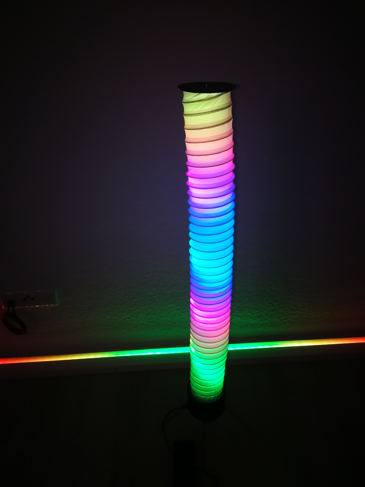
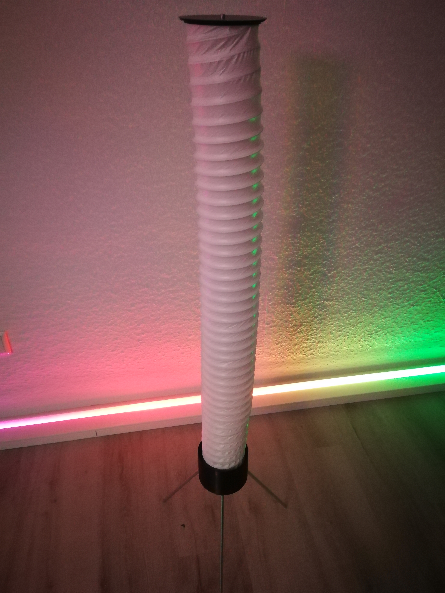
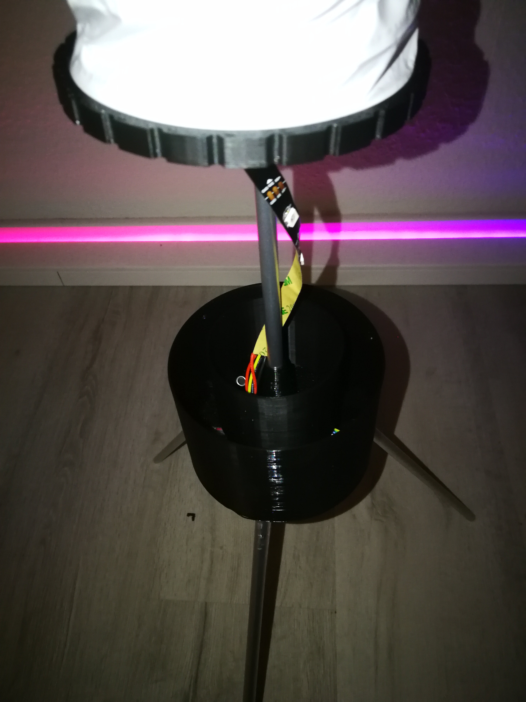
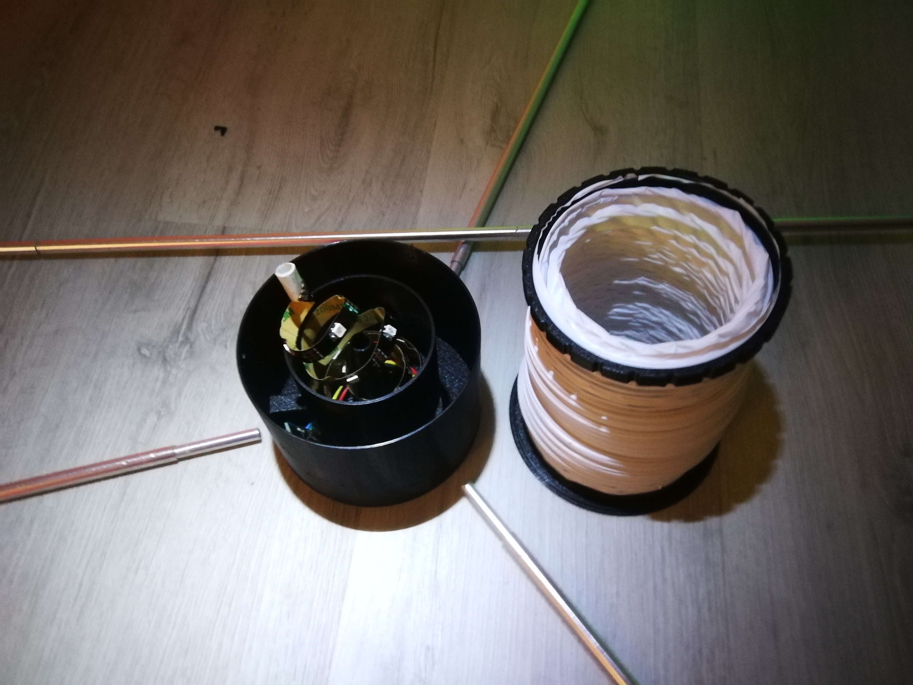
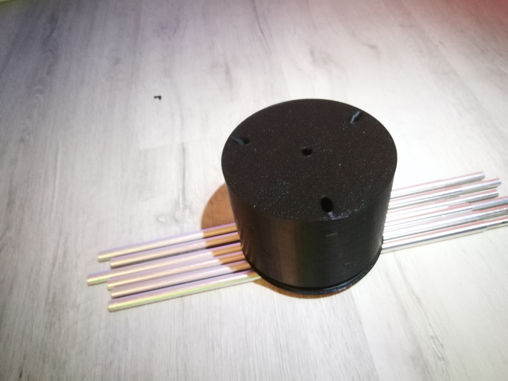
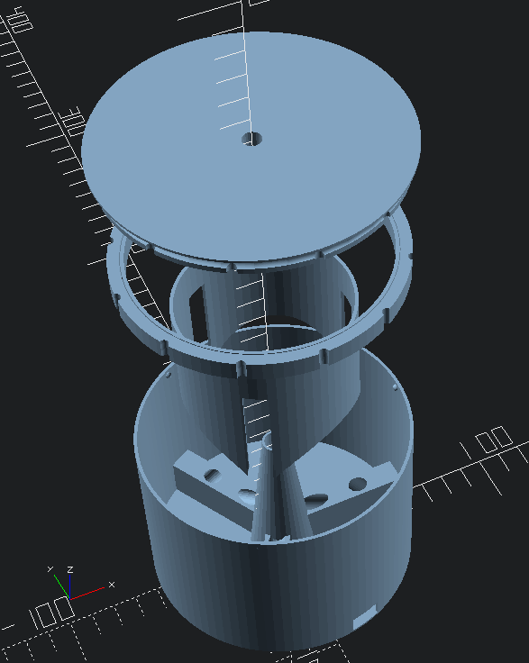
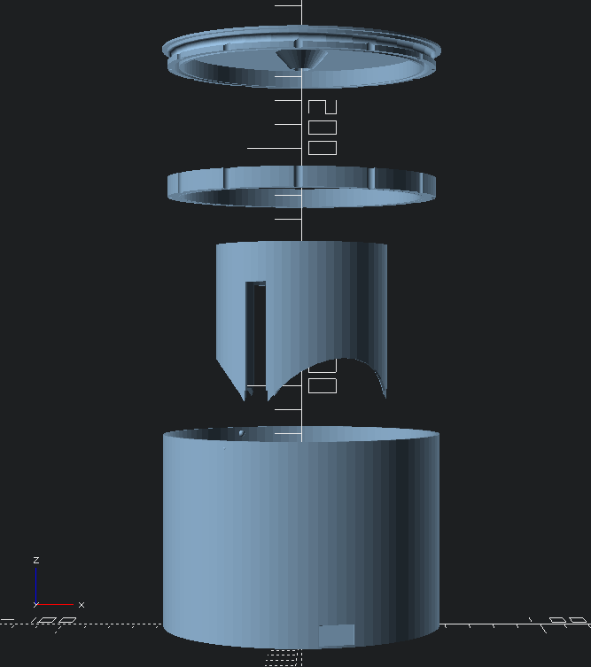
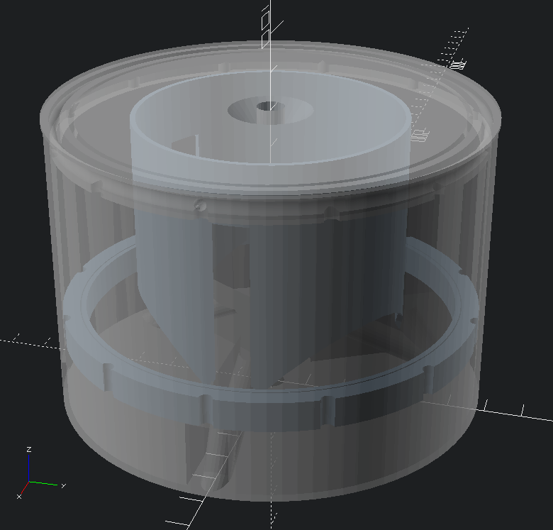
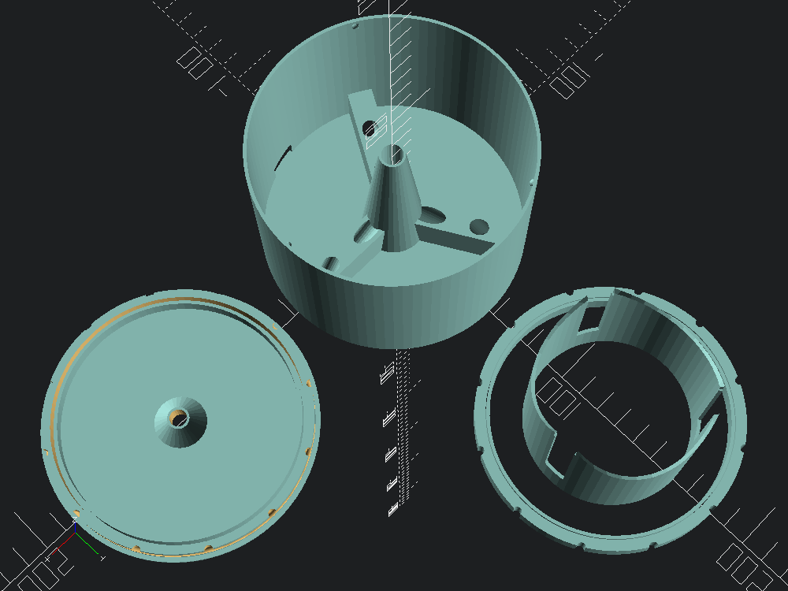
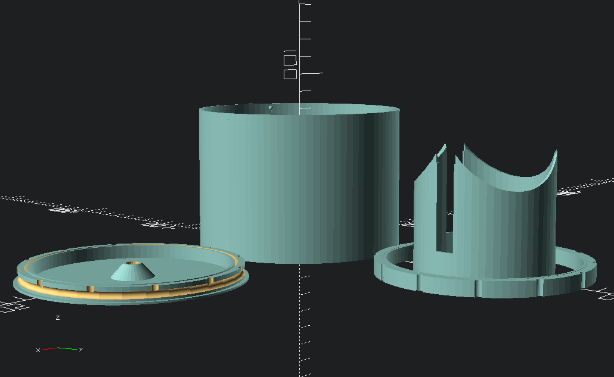

# Lichtsäule (a compactable light column)

This is a compactable light column, using cheap and widely available
components apart from the 3D printed ones. SCAD file is parametrizeable,
it should work with any flexible PVC pipe and any camping rods.

## Parts

* The 3D printed parts from Lichtsaeule.scad
* Camping rods (I used cheap aluminium rods with 30cm length + 4cm
    coupling extension, 8.4mm outer diameter/7.2mm coupling diameter)
* 1m flexible PVC pipe with spiral wire (in germany, it's called
    "flexibler Abluftschlauch (PVC, weiß)")
* 1m of any IP30 LED stripe with a controller that fits in the base
    (I used 1m WS2812b IP30 stripe with 30 SMD5050 LEDs per meter, an
    ESP8266 D1 mini board with a FastLED example sketch and a separate
    USB connection module).

## Photos

## Technical Views

